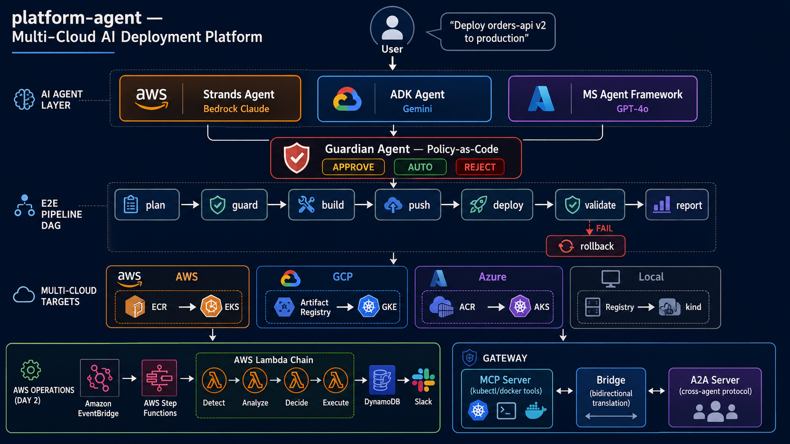

# platform-agent

> **Your always-on platform engineer — from service provisioning to incident resolution.**

AWS-native platform agent that covers both Day 1 and Day 2 workflows:
provision infrastructure, validate deployments, track service health, and respond to incidents.

```
Slack / Jira / GitHub / Alarm
    → Router Agent
    → Provisioning Agent   (CDK + IAM + cost estimate)
    → Deployment Agent     (smoke test + canary + rollback)
    → Operations Agent     (detect + analyze + decide + execute)
    → Guardian Agent       (policy-as-code gatekeeper)
```

### Multi-Cloud AI Deployment Platform

```
Natural Language Request
    → Strands Agent    (AWS — Bedrock Claude)
    → ADK Agent        (GCP — Gemini 3.5 Flash)
    → MS Agent Framework (Azure — GPT-5.4)
    → On-Prem Agent    (On-Prem — Local LLM or API Key)
    → Guardian Agent   (Policy: APPROVE / AUTO / REJECT)
    → E2E Pipeline DAG (plan→guard→build→push→deploy→validate→report)
```

---

## Why this exists

Most AWS tooling solves only one slice of the platform lifecycle. `platform-agent` connects the full loop.

| Tool | What it does |
|------|-------------|
| PagerDuty / OpsGenie | Pages a human |
| CloudWatch Alarms | Emits an incident signal |
| Internal platform scripts | Provision or deploy one step at a time |
| **platform-agent** | Provisions → validates deploys → tracks SLOs → responds to incidents |

---

## Architecture



```
Slack / Jira / GitHub / Alarm
        │
        ▼
Router Agent + Overnight Harness
        │
        ├─ Provisioning Agent
        │    CDK generation, IAM design, cost estimation
        │
        ├─ Deployment Agent
        │    Smoke test, canary analysis, rollback decision
        │
        └─ Operations Agent
             Detector → Analyzer → Decision → Executor
             CloudWatch Logs/X-Ray → Bedrock RCA → SSM/Slack
```

**Key service choices (SAP-aligned):**
- **Step Functions** over SWF — serverless orchestration, visual debugging, native CDK integration
- **EventBridge** over SNS — event pattern filtering across alarms and scheduled flows
- **Bedrock** over external LLM API — IAM-authenticated reasoning without extra egress
- **SSM Automation** over direct Lambda execution — audit trail, approval gates, reusable runbooks
- **CDK (TypeScript)** over raw templates — consistent Day 1 provisioning output

---

## Supported alarm types (built-in runbooks)

| Alarm type | Runbook | Auto actions |
|-----------|---------|-------------|
| EKS pod OOM / restart loop | `eks-pod-oom` | Restart pod → Scale node group |
| Lambda throttling | `lambda-throttle` | Increase reserved concurrency |
| RDS CPU high | `rds-cpu-high` | Scale instance → Add read replica |
| Kafka consumer lag | `kafka-lag-spike` | Scale consumer group → Rebalance |
| Disk full | `disk-full` | Cleanup disk → Expand volume |
| Health check failure | `health-check-failure` | Restart workload → Rollback release |
| Certificate expiry | `certificate-expiry` | Renew certificate → Notify ops |
| Network latency high | `network-latency-high` | Drain node → Scale out |
| Any other alarm | `generic-recovery` | Slack alert only |

Custom runbooks can be registered in DynamoDB (`incident-runbooks` table).
Deployments also seed the built-in capability-based runbook catalog into that table by default.
Scheduled reporting jobs generate daily SLO summaries, weekly on-call reports, and monthly capacity recommendations.

---

## Remediation modes

| Severity | Mode | Behaviour |
|---------|------|-----------|
| P1 | AUTO | SSM executes immediately, polls to completion |
| P2 | APPROVE | Slack interactive approval request sent, Step Functions waits up to 1h |
| P3 | MANUAL | No execution — incident recorded, Slack notified |

Safety override: any action containing `Delete`, `Drop`, or `Terminate` is forced to `APPROVE` regardless of severity.

---

## Key Features & Highlights

### 1. Keyless Federated Multi-Cloud Integration (OIDC)
To achieve least-privilege security aligned with the AWS Well-Architected Framework (SAP guidelines), `platform-agent` uses **Workload Identity Federation (WIF)** instead of storing long-lived, high-risk credentials.
* **GCP WIF Integration**: Exchanges signed AWS STS token credentials for a temporary Google OAuth2 access token to securely orchestrate GKE and Cloud Run deployments.
* **Azure Federated Token Exchange**: Swaps AWS JWT identity assertions for temporary Azure Resource Manager (ARM) tokens to manipulate AKS workloads and Azure Functions.

### 2. Multi-Region Failover & Disaster Recovery (Resilience)
The remediation execution path is resilient to regional cloud provider outages:
* **AWS SSM Failover**: Automatically retries SSM execution in `AWS_FAILOVER_REGION` (e.g. `us-east-1`) if the primary region encounters availability faults.
* **GCP GKE / Cloud Run Failover**: Detects Kubernetes cluster lookup or API server connection failures and automatically routes the recovery action to the standby `GCP_FAILOVER_CLUSTER_NAME` or backup region.
* **Azure AKS / Function App Failover**: Transparently switches to secondary failover clusters (`AZURE_FAILOVER_CLUSTER_ID`) and backup applications upon primary endpoint timeouts or faults.

### 3. Real-time Next.js Operations Console
The companion dashboard is a production-ready, high-security console for viewing telemetry and authorizing overrides:
* **Keyless IAM Read/Write**: Integrates with AWS via OpenID Connect (OIDC) using Vercel Workload Identity, eliminating the need to store AWS keys on Vercel.
* **Role-Based Access Control (RBAC)**: Supports roles (`Admin`, `Operator`, `Viewer`) dynamically mapped via DynamoDB override tables.
* **Interactive Control Panels**: Operators and admins can approve pending Step Functions tasks, trigger manual builds, or run rollbacks directly.
* **Users & Role Overrides Console**: Dedicated `/users` control panel for promoting/demoting user access permissions, equipped with lockout-prevention protection to prevent administrators from self-demotion.
* **Security Audit Logging**: Full logs of admin and operator actions recorded in DynamoDB, searchable and filterable in the `/audit` console.
* **Live-Only Data Streaming**: All dummy simulation mock fallbacks have been removed; the console displays and writes only live production telemetry.

---


## Quick start

### Prerequisites
- AWS CLI configured (`aws configure`)
- Node.js 18+ (CDK)
- Python 3.11+

### 1. Clone & install

```bash
git clone https://github.com/your-org/platform-agent
cd platform-agent

# Python dependencies
pip install -e ".[dev]"

# CDK dependencies
cd src/stacks && npm install && cd ../..
```

### 2. Configure

```bash
cp .env.example .env
# Edit .env:
#   SLACK_WEBHOOK_URL = your Slack incoming webhook
#   SLACK_SIGNING_SECRET = your Slack app signing secret
#   AWS_REGION        = your target region
```

### 3. Deploy

```bash
cd src/stacks
export CDK_DEFAULT_ACCOUNT=$(aws sts get-caller-identity --query Account --output text)
export CDK_DEFAULT_REGION=ap-northeast-2
npx cdk deploy
```

After deploy, set the `ApprovalBridgeFunctionUrl` CloudFormation output as your Slack app's
Interactivity Request URL so the Approve / Reject buttons can call back into the pipeline.

### 4. Test

```bash
# Unit tests (no AWS calls)
pytest tests/ -v

# Trigger a test alarm manually
aws cloudwatch set-alarm-state \
  --alarm-name "your-alarm-name" \
  --state-value ALARM \
  --state-reason "Manual test"
```

---

## Project structure

```
platform-agent/
├── scripts/overnight/             # Overnight harness state (gate, settings, logs)
│   ├── overnight-settings.json    # Claude permission boundary
│   ├── opencode.json              # opencode permission config
│   └── Makefile.harness.snippet   # Makefile integration
│
├── infra/local/                   # On-prem K8s 로컬 테스트 환경 (kind)
│   ├── kind-config.yaml           # 3-node cluster + registry
│   ├── setup.sh                   # Registry + kind + ingress
│   └── teardown.sh
│
├── .claude/harness-config.json    # Per-repo harness config (doc paths, gate, engine)
├── .kiro/                         # Kiro CLI agent profile + steering docs
├── .codex/rules/overnight.rules   # Codex permission rules
│
├── src/
│   ├── agents/
│   │   ├── models.py              # Shared dataclasses (AlarmContext → ExecutorOutput)
│   │   ├── provisioning/          # Day 1: CDK gen + manifest gen + CLI
│   │   ├── deployment/            # Smoke/canary/rollback helpers
│   │   ├── operations/            # Canonical Day 2 handlers + reporting
│   │   ├── adapters/deployment/   # Multi-cloud adapters (onprem/aws/gcp/azure)
│   │   └── ai/
│   │       ├── strands_deployer.py   # Strands Agent (AWS/Local — Bedrock)
│   │       ├── adk_deployer.py       # ADK Agent (GCP — Gemini)
│   │       ├── msft_deployer.py      # MS Agent Framework (Azure — GPT-5.4)
│   │       ├── guardian.py           # Guardian Agent (policy gatekeeper)
│   │       ├── policy_engine.py      # YAML policy parser/evaluator
│   │       ├── pipeline.py           # E2E Pipeline DAG
│   │       ├── orchestrator.py       # CLI entry point
│   │       ├── a2a_card.json         # A2A protocol Agent Card
│   │       ├── policies/             # deploy-policy.yaml
│   │       ├── tools/                # @tool functions (build/push/deploy/validate/rollback)
│   │       └── gateway/              # MCP Server + A2A Server + Bridge
│   ├── stacks/                # CDK v2 TypeScript
│   └── step_functions/        # State machine JSON
│
├── docs/
│   ├── test/                  # Integration test results
│   ├── engineering/           # Harness engineering bibles
│   ├── architecture.md
│   ├── agents.md
│   └── status.md
│
├── examples/
│   └── orders-api.yaml        # ServiceSpec example
│
└── tests/                     # 329 unit tests
    ├── test_strands_deployer.py
    ├── test_cloud_native_deployers.py
    ├── test_guardian.py
    ├── test_gateway.py
    ├── test_pipeline.py
    └── ...
```

Current implementation snapshot: [`docs/status.md`](docs/status.md)

---

## IAM — least privilege

Each agent has its own IAM role. No shared execution role.

| Agent | Permissions |
|-------|------------|
| Detector | `logs:StartQuery`, `xray:GetTraceSummaries`, `cloudwatch:GetMetricStatistics` |
| Analyzer | `bedrock:InvokeModel` (scoped to model ARN), `dynamodb:GetItem` on incident table |
| Decision | `dynamodb:GetItem` on runbook table, `sns:Publish` on alert topic |
| Executor | `ssm:StartAutomationExecution` (scoped to specific document prefixes), `dynamodb:PutItem` |

---

## Overnight harness

This project uses the **[claude-overnight-harness](https://github.com/men16922/claude-overnight-harness)** plugin for unattended AI-assisted development loops.

The harness drives a headless coding agent (Claude, Codex, opencode, AGY, or Kiro) one iteration at a time, verifying a gate command after each commit.

```bash
# Install the plugin (Claude surface)
/plugin marketplace add https://github.com/men16922/claude-overnight-harness.git
/plugin install overnight-harness@overnight-harness

# Run a single iteration (smoke test)
MAX_ITER=1 GATE_CMD="pytest tests/ -v" make overnight-once

# Run overnight loop
ENGINE=kiro KIRO_AGENT=overnight-harness MAX_ITER=20 make overnight

# Check status
make overnight-status
make overnight-logs
make overnight-stop
```

Config: `.claude/harness-config.json` | Permissions: `scripts/overnight/overnight-settings.json`

See [`docs/engineering/HARNESS_ENGINEERING.md`](docs/engineering/HARNESS_ENGINEERING.md) for details.

---

## Roadmap

- [x] Multi-cloud deployment adapters (AWS/GCP/Azure/Local)
- [x] AI Agent deployers (Strands/ADK/MS Agent Framework)
- [x] Policy-as-Code Guardian Agent
- [x] MCP + A2A Gateway for cross-agent communication
- [x] E2E Pipeline DAG orchestration
- [x] On-prem Kubernetes integration (kind for local testing)
- [x] CDK deploy to AWS (EventBridge + Step Functions + Lambda)
- [x] LLM 실호출 검증 (Bedrock Claude + Vertex AI Gemini 3.5 Flash + Azure OpenAI GPT-5.4)
- [x] Slack interactive buttons for APPROVE/REJECT (replace SQS polling)
- [x] GCP/Azure live provider connection (GKE/AKS cluster REST API runner)
- [x] Live multi-cloud OIDC Workload Identity Federation (WIF) credential integration
- [x] AWS/GCP/Azure multi-region & backup cluster automated failover recovery
- [x] Users Identity & role overrides management console
- [x] Audit logs search & filters viewer page
- [x] Next.js Dashboard live DynamoDB connection without mockup data fallback
- [x] Capability-based runbook schema (cloud-neutral execution)

---

## License

MIT
