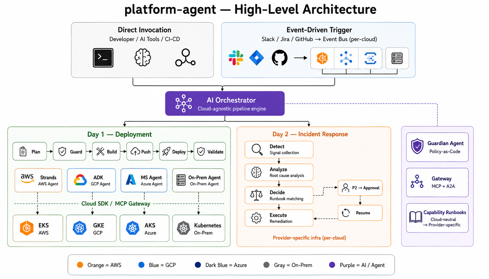
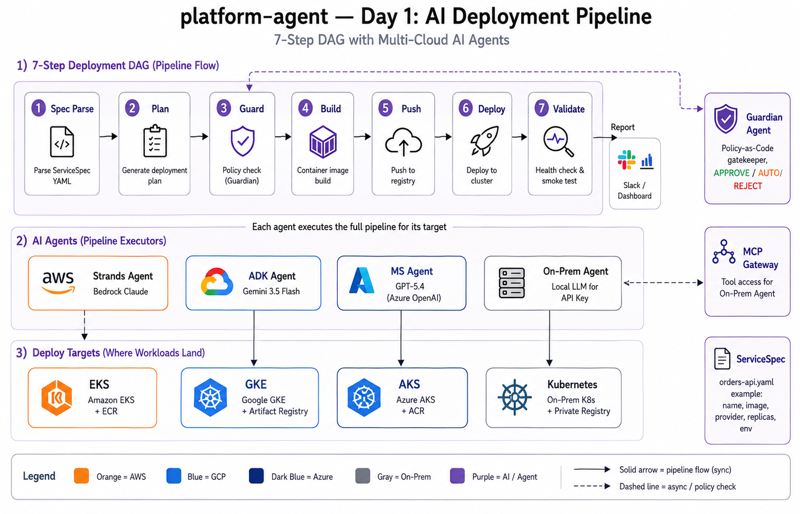
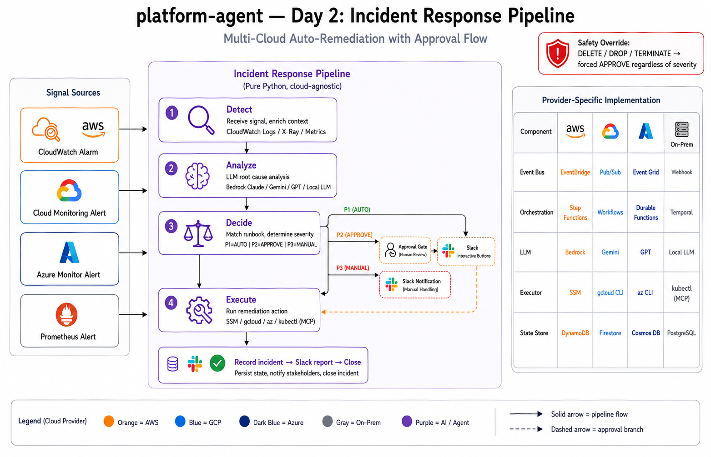

# ARCHITECTURE.md — platform-agent 아키텍처 상세

---

## 환경별 기술 스택 (한눈에)

프로비저닝 · 배포 · 에이전트 런타임 · Day-2를 환경별로 정리한 **단일 레퍼런스**. 상세는 각 섹션 참조. 모든 레이어는 `ServiceSpec`(선언적 의도)을 AI 에이전트가 해석해 실행하며, **capability → 환경별 네이티브 어댑터** 패턴으로 통일된다.

| 레이어 | AWS | GCP | Azure | On-Prem |
|---|---|---|---|---|
| **Provision (IaC)** | CDK / Terraform | gcloud / Terraform | az / Terraform | **Terraform + Ansible** |
| **Cluster** | EKS | GKE | AKS | kind · k3s · kubeadm |
| **Registry** | ECR | Artifact Registry | ACR | Harbor · local registry |
| **Build** | CodeBuild | Cloud Build | ACR Tasks | docker build |
| **Push** | ECR | Artifact Registry | ACR | private registry |
| **Deploy** | kubectl → EKS | kubectl → GKE | kubectl → AKS | kubectl → local |
| **Validate** | HTTP health + kubectl | 〃 | 〃 | 〃 |
| **AI Agent (deploy)** | Strands + Bedrock Claude | ADK + Gemini 3.5 Flash | MSFT SDK + Azure GPT-5.4 | **Pydantic AI + Local Qwen (MLX)** |
| **Agent Runtime** | Bedrock AgentCore | Vertex AI Agent Engine | Foundry Agent Service | **kagent (CNCF)** |
| **Day-2 (Event / Orch)** | EventBridge / Step Functions | Pub/Sub / Cloud Workflows | Event Grid / Durable Functions | Webhook / Temporal |

**구현 상태:** Deploy(4-provider) ✅ · On-Prem Provision(Terraform kind + Ansible k3s) ✅ · Day-2(AWS/GCP/Azure) ✅ · **Orchestrator(supervisor) 라우팅 + A2A Agent Card discovery/위임 ✅**(실 kagent 에이전트 대상 라이브 검증, 아래 "Orchestrator + A2A" 섹션) · 클라우드 Provision·Agent Runtime 매니지드 호스팅·MCP Gateway 단일 카탈로그 통합 = 🔲 로드맵.

> **AI Model Router:** 위 "AI Agent (deploy)"는 각 환경의 *네이티브(recommended)* 조합일 뿐이다. 모델(두뇌)과 환경(대상)은 분리돼 있어 어떤 모델이든 어떤 환경에 배포할 수 있고, 적합도만 표기된다 ([상세](#ai-model-router-모델--환경-분리)).

---

## 1. High-Level Architecture (전체 구조)



```
┌─────────────────────────────────────────────────────────────────────────────┐
│                         누가 파이프라인을 시작하는가?                         │
│                                                                             │
│  PATH A: 직접 호출                    PATH B: 이벤트 기반 자동 트리거        │
│  ┌───────────────────────┐           ┌────────────────────────────────┐     │
│  │ • 개발자 (터미널)      │           │ Slack / Jira / GitHub webhook  │     │
│  │ • AI 도구             │           │           ↓                    │     │
│  │   (Claude Code, Codex,│           │ 이벤트 수신 레이어 (환경별):   │     │
│  │    Kiro, AGY)         │           │  AWS: EventBridge → Lambda     │     │
│  │ • CI/CD              │           │  GCP: Pub/Sub → Cloud Func     │     │
│  │   (GitHub Actions,    │           │  Azure: Event Grid → Az Func   │     │
│  │    Jenkins 등)        │           │  On-Prem: Webhook (FastAPI)    │     │
│  └───────────┬───────────┘           └──────────────┬─────────────────┘     │
│              │                                      │                       │
│              └──────────────┬───────────────────────┘                       │
│                             ▼                                               │
│              ┌───────────────────────────────┐                              │
│              │      AI Orchestrator          │                              │
│              │    (배포 파이프라인 엔진)       │                              │
│              │                               │                              │
│              │  "서비스 X를 버전 Y로,        │                              │
│              │   환경 Z에, provider P로 배포" │                              │
│              │                               │                              │
│              │  → 7-step DAG 실행            │                              │
│              │  → provider에 맞는 AI Agent    │                              │
│              │    가 자율적으로 빌드/배포     │                              │
│              └──────────────┬────────────────┘                              │
└─────────────────────────────┼───────────────────────────────────────────────┘
                              │
              ┌───────────────┼───────────────────┐
              ▼               ▼                   ▼
    ┌──────────────┐   ┌──────────────┐   ┌──────────────┐
    │ Day 1        │   │ Day 2        │   │ Cross-cutting│
    │ AI 배포      │   │ 인시던트     │   │              │
    │              │   │ 자동 대응    │   │ Guardian     │
    │              │   │              │   │ Gateway      │
    │              │   │              │   │ Runbooks     │
    └──────────────┘   └──────────────┘   └──────────────┘
```

### AI Orchestrator란?

배포 파이프라인을 실행하는 **엔진**. 입력으로 "무엇을 어디에 배포할지"를 받으면, 7단계 DAG를 순서대로 실행한다.

- 특정 클라우드에 종속되지 않음 (순수 Python)
- 어디서 실행하든 동일하게 동작 (개발자 노트북, CI 서버, Lambda, Cloud Function)
- provider 값에 따라 적절한 AI Agent를 선택해서 배포 수행

### 핵심 설계 원칙

| 원칙 | 설명 |
|------|------|
| **파이프라인 엔진 = 클라우드 독립** | 어떤 환경에서든 실행 가능. 클라우드 SDK 의존 없음 |
| **호스팅 레이어 = 교체 가능** | AWS(EventBridge+Lambda)는 하나의 구현. GCP/Azure/On-Prem도 동일 패턴으로 확장 |
| **Agent-per-cloud** | 각 클라우드에 네이티브 프레임워크 Agent (Strands/ADK/MSFT/Pydantic AI) |
| **AI Model Router** | 모델(두뇌) ↔ 환경(대상) 분리 — 어떤 LLM이든 어떤 환경에 배포, 적합도 검증 |
| **Agent Runtime per environment** | 각 환경을 그 클라우드의 네이티브 매니지드 에이전트 런타임 위에서 실행 (AWS=AgentCore, GCP=Agent Engine, Azure=Foundry, On-Prem=kagent) — [아래](#agent-runtime-레이어-agentcore-레퍼런스--멀티클라우드-로드맵) |
| **Provision + Deploy (2-role)** | ServiceSpec 기반 두 역할: ① Provision(IaC, 온프렘=Terraform/Ansible) ② Deploy(build→push→deploy→validate). 둘 다 capability→환경별 어댑터 |
| **Policy as Code** | Guardian Agent가 모든 배포에 대해 APPROVE/AUTO/REJECT 판정 |

### 진입 경로 비교

| 경로 | 트리거 주체 | 설명 |
|------|-----------|------|
| **PATH A: 직접 호출** | 개발자, AI 도구, CI/CD | 클라우드 무관. Orchestrator를 직접 호출 |
| **PATH B: 이벤트 기반** | Slack/Jira/GitHub webhook | 호스팅 환경에 따라 이벤트 수신 방식이 다름 |

**PATH B 호스팅별 구현 상태:**

| 호스팅 환경 | 이벤트 수신 | 오케스트레이션 | 상태 |
|------------|-----------|--------------|------|
| AWS | EventBridge → Lambda | Step Functions | ✅ 구현 |
| GCP | Pub/Sub → Cloud Functions | Cloud Workflows | ✅ 구현 |
| Azure | Event Grid → Azure Functions | Durable Functions | ✅ 구현 |
| On-Prem | Webhook (FastAPI) | 직접 호출 (in-process 4-step) | ✅ 구현 (`onprem_webhook_api`) |

두 경로 모두 동일한 **AI Orchestrator**로 수렴한다.

---

## 2. AI Deployment Pipeline (Day 1 상세)



```
┌─────────────────────────────────────────────────────────────────────────────┐
│                         Guardian Agent (Policy-as-Code)                       │
│                    ┌──────────────────────────────────┐                      │
│                    │  deploy-policy.yaml              │                      │
│                    │  • prod → APPROVE (사람 승인)    │                      │
│                    │  • staging → AUTO               │                      │
│                    │  • "delete" 포함 → REJECT       │                      │
│                    └──────────────┬───────────────────┘                      │
│                                   │                                          │
│                                   ▼                                          │
│  ┌──────┐  ┌──────┐  ┌───────┐  ┌───────┐  ┌──────┐  ┌────────┐  ┌──────┐│
│  │ Spec │→│ Plan │→│ Guard │→│ Build │→│ Push │→│ Deploy │→│Validate│→Report│
│  └──────┘  └──────┘  └───────┘  └───────┘  └──────┘  └────────┘  └──────┘│
│                          │                                                   │
│                    REJECT → 중단                                             │
│                    APPROVE → 사람 승인 대기                                  │
│                    AUTO → 자동 진행                                          │
└─────────────────────────────────────────────────────────────────────────────┘

                              │ provider 선택
            ┌─────────────────┼─────────────────┬────────────────┐
            ▼                 ▼                 ▼                ▼
  ┌──────────────────┐ ┌───────────────┐ ┌───────────────┐ ┌──────────────┐
  │ Strands Agent    │ │ ADK Agent     │ │ MS Agent      │ │ On-Prem Agent│
  │ (AWS)            │ │ (GCP)         │ │ (Azure)       │ │              │
  │                  │ │               │ │               │ │ LLM: Any     │
  │ LLM: Bedrock    │ │ LLM: Gemini   │ │ LLM: GPT-5.4 │ │ (Local LLM   │
  │      Claude     │ │   3.5 Flash   │ │ Azure OpenAI  │ │  or API Key) │
  │                  │ │               │ │               │ │              │
  │ Tools:           │ │ Tools:        │ │ Tools:        │ │ Tools:       │
  │  aws_build_image│ │ gcp_build_img │ │ azure_build   │ │ onprem_build │
  │  aws_push_image │ │ gcp_push_img  │ │ azure_push    │ │ onprem_push  │
  │  aws_deploy     │ │ gcp_deploy    │ │ azure_deploy  │ │ onprem_deploy│
  │  validate       │ │ validate      │ │ validate      │ │ validate     │
  │  rollback       │ │ rollback      │ │ rollback      │ │ rollback     │
  └────────┬─────────┘ └──────┬────────┘ └──────┬────────┘ └──────┬───────┘
           │                   │                  │                  │
           ▼                   ▼                  ▼                  ▼
  ┌──────────────────┐ ┌───────────────┐ ┌───────────────┐ ┌──────────────┐
  │ AWS              │ │ GCP           │ │ Azure         │ │ On-Prem      │
  │ EKS + ECR       │ │ GKE +         │ │ AKS + ACR     │ │ Kubernetes   │
  │ CodeBuild       │ │ Artifact Reg  │ │ ACR Tasks     │ │ + Private    │
  │                  │ │ Cloud Build   │ │               │ │   Registry   │
  │ (Cloud SDK)     │ │ (Cloud SDK)   │ │ (Cloud SDK)   │ │ (via MCP     │
  │                  │ │               │ │               │ │  Gateway)    │
  └──────────────────┘ └───────────────┘ └───────────────┘ └──────────────┘
```

### Agent별 역할

| Agent | 프레임워크 | 담당(네이티브) | LLM | 인프라 접근 방식 |
|-------|-----------|--------------|-----|----------------|
| **Strands Agent** | Strands | AWS | Bedrock Claude | Cloud SDK (aws cli) |
| **ADK Agent** | Google ADK | GCP | Vertex AI Gemini 3.5 Flash | Cloud SDK (gcloud) |
| **MS Agent** | MSFT Agent SDK | Azure | Azure OpenAI GPT-5.4 | Cloud SDK (az cli) |
| **On-Prem Agent** | **Pydantic AI** | On-Prem K8s | Local MLX Qwen (or any OpenAI-compat) | in-process 도구 (kubectl/docker/terraform subprocess) |

- AWS/GCP/Azure: 각 cloud SDK를 직접 호출하여 빌드/푸시/배포.
- On-Prem: 인터랙티브 에이전트(`local_deployer`)는 **in-process Python 도구**로 직접 실행. **MCP Gateway는 A2A/외부 에이전트용 별개 경로**이며, 인터랙티브 에이전트의 MCP Gateway 통합은 [로드맵](#orchestrator--a2a-멀티에이전트-통합--타깃)이다.
- "담당(네이티브)"는 recommended 환경일 뿐, AI Model Router가 모델↔환경을 분리한다 (아래).

### AI Model Router (모델 ↔ 환경 분리)

배포 도구(build/push/deploy/validate)는 provider-neutral이고 각 deployer는 `provider`(대상 환경)를 인자로 받는다. 따라서 **LLM(두뇌)과 배포 환경(대상)은 분리**되며, 어떤 모델이든 어떤 환경에든 배포할 수 있다. `src/agents/ai/model_router.py`가 이 라우팅과 **적합도(suitability) 검증**을 담당한다.

| 환경 | recommended (네이티브) | allowed (선택 가능, 사유 표기) |
|------|----------------------|------------------------------|
| **on-prem** | 🟢 Local Qwen (완전 오프라인) | Bedrock Claude · Gemini · Azure GPT (클라우드 두뇌 → air-gap 상실) |
| **aws** | 🟢 Bedrock Claude | 나머지 3종 (non-native) |
| **gcp** | 🟢 Vertex Gemini | 나머지 3종 |
| **azure** | 🟢 Azure GPT-5.4 | 나머지 3종 |

- 모델 id: `local-qwen`(Pydantic AI/MLX) · `bedrock-claude`(Strands) · `vertex-gemini`(ADK) · `azure-gpt`(MSFT)
- `local-qwen`은 완전 오프라인 실행(MLX). 클라우드 모델은 검증 후 네이티브 deployer로 디스패치(해당 클라우드 credential 필요).
- HTTP 표면 `src/agents/ai/local_deploy_api.py`: `GET /api/models?provider=`(환경별 선택지, recommended-first) + `POST /api/local-deploy`(model+provider+자연어 instruction → 실행). 대시보드 Agents 채팅이 이 API를 호출한다.
- 실행부(로컬 API)가 결과를 기록하고 대시보드는 읽기만 한다(read-only 역할 유지).

### Agent Runtime 레이어 (AgentCore 레퍼런스 + 멀티클라우드 로드맵)

> **방향:** "배포 전용"에서 **범용 agentic ops**로. 에이전트에게 자연어로 질의하면 가능한 작업을 tool call로 자율 수행하며(배포는 그중 하나), 각 환경은 그 클라우드의 **네이티브 매니지드 에이전트 런타임** 위에서 돈다. AI Model Router가 **Agent Runtime Router**로 확장된다.

**핵심 발견 (AgentCore):** Amazon Bedrock AgentCore Runtime은 **프레임워크·모델 무관** — Strands / LangGraph / CrewAI / LlamaIndex / ADK / OpenAI Agents SDK / Pydantic AI 등 어떤 OSS 프레임워크든, 어떤 모델(Bedrock / OpenAI / Gemini / Nova)이든 서버리스로 호스팅하고 MCP·A2A 프로토콜을 지원한다. 구성요소를 우리 프로젝트에 매핑하면:

| AgentCore 구성요소 | 역할 | 우리 대응 |
|---|---|---|
| **Runtime** | 서버리스 에이전트 호스팅 (any framework/model, HTTP+streaming) | `local_deploy_api` (자체 런타임, SSE) |
| **Gateway** | API/Lambda → MCP tool 자동 변환 | ✅ MCP Server (kubectl 5 + docker 4 = 9 tool) |
| **Memory** | 세션/장기 컨텍스트 | 🔲 (현재 stateless) |
| **Identity** | 에이전트별 신원 (Cognito / Entra / Okta) | 대시보드 RBAC (부분) |
| **Observability** | OpenTelemetry 트레이스/메트릭 | ✅ DEPLOY/ACTIVITY 트레이스 기록 + 배포 상세 페이지 |
| **Tools** | Code Interpreter / Browser | 🔲 |

**레퍼런스 (`whchoi98/awsops`):** AgentCore Runtime + Strands + 8 MCP 게이트웨이(125 tools) + route classifier(질의→최적 게이트웨이 라우팅) + Steampipe 데이터 레이어. 우리가 지향하는 패턴과 동일하다.

**환경별 네이티브 에이전트 런타임 매핑:**

| 환경 | 매니지드 런타임 | 프레임워크(개발) | 우리 매핑 | 상태 |
|---|---|---|---|---|
| **AWS** | Bedrock AgentCore Runtime | Strands | Strands 보유 → AgentCore 호스팅 | 🔲 로드맵 |
| **GCP** | Vertex AI Agent Engine | ADK | ADK 보유 → Agent Engine 배포 | 🔲 로드맵 |
| **Azure** | Foundry Agent Service (hosted agents) | MS Agent Framework / LangGraph | MSFT SDK 보유 → Foundry 호스팅 | 🔲 로드맵 |
| **On-Prem** | **kagent (CNCF)** — K8s CRD 에이전트, MCP+A2A | AutoGen 기반 (또는 Pydantic AI/LangGraph 컨테이너) | 현재 Pydantic AI 직접 → kagent가 "on-prem AgentCore" 대응물 | 🔲 로드맵 |

- **AgentCore는 AWS 매니지드**라 on-prem엔 못 쓴다 → on-prem 대응물은 **kagent** (클러스터 내부 실행, 에이전트=CRD로 Git 관리, MCP/A2A). "완전 오프라인 K8s" 서사와 정확히 부합한다.
- **AI Model Router → Agent Runtime Router**: 라우팅 키가 `(model, environment)` → `(model, environment, runtime)`로 확장. 각 환경은 네이티브 런타임에서 실행하고, 도구는 **MCP 게이트웨이**로 통합한다.
- **현재 구현**은 프레임워크 직접 호출(Strands/ADK/MSFT/Pydantic AI) + 자체 로컬 런타임(`local_deploy_api`). 위 매니지드 런타임 호스팅은 로드맵이다.
- **범용 ops로 확장:** 도구셋을 배포(build/push/deploy/validate) 밖으로 넓히고(조회/진단/스케일/롤백/비용 등, MCP 게이트웨이 기반), 시스템프롬프트를 일반화하며, 추론(reasoning) 스트리밍을 추가한다.

출처: [Bedrock AgentCore](https://docs.aws.amazon.com/bedrock-agentcore/latest/devguide/what-is-bedrock-agentcore.html) · [any framework](https://docs.aws.amazon.com/bedrock-agentcore/latest/devguide/using-any-agent-framework.html) · [Vertex AI Agent Engine](https://google.github.io/adk-docs/deploy/agent-engine/) · [Foundry Agent Service](https://learn.microsoft.com/en-us/azure/foundry/agents/overview) · [kagent (CNCF)](https://kagent.dev/)

### 2-역할 에이전트: Provision + Deploy (capability 기반)

> **원칙:** `ServiceSpec`(선언적 의도)을 AI 에이전트가 해석해 두 역할로 실행한다. 두 역할 모두 **capability → 환경별 네이티브 어댑터** 패턴(Day-2 runbook과 동일)을 재사용한다 — 즉 "무엇을(capability)"만 선언하고, 실행 시점에 환경의 네이티브 도구로 해석한다.

```
                     ServiceSpec (선언적 의도)
                            │  AI Agent가 해석
             ┌──────────────┴──────────────┐
             ▼                             ▼
   ┌────────────────────┐        ┌────────────────────┐
   │ ① Provision Agent   │        │ ② Deploy Agent      │
   │   (Day-0/1 · IaC)   │        │   (Day-1 · App)     │
   │  플랫폼/클러스터     │  ───▶  │  build → push →     │
   │  프로비저닝          │        │  deploy → validate  │
   └────────────────────┘        └────────────────────┘
```

**① Provision (IaC) — 온프렘 = Terraform + Ansible**

| capability | AWS | GCP | Azure | On-Prem | 상태 |
|---|---|---|---|---|---|
| 인프라 제어 | CDK / Terraform (aws cli) | gcloud / Terraform | az / Terraform | **Terraform + Ansible** | AWS만 CDK 계획 생성, 나머지 🔲 |
| 클러스터 | EKS | GKE | AKS | **kubeadm/k3s (Ansible) · kind (Terraform)** | 온프렘 스크립트만 🔲 |
| 레지스트리 | ECR | Artifact Registry | ACR | **Harbor** | 🔲 |

- 역할 분리: **Terraform = 인프라(VM/클러스터 substrate) 프로비저닝**, **Ansible = 노드 구성(k8s 설치)**. 실 온프렘은 Terraform이 베어메탈/VM을 프로비저닝 → Ansible이 kubeadm/k3s 설치.

**② Deploy (App) — 구현 완료 ✅** (per-environment 네이티브 어댑터)

| 단계 | AWS (EKS) | GCP (GKE) | Azure (AKS) | On-Prem |
|---|---|---|---|---|
| Build | CodeBuild ✅ | Cloud Build ✅ | ACR Tasks ✅ | docker build ✅ |
| Push | ECR ✅ | Artifact Registry ✅ | ACR ✅ | Private Registry ✅ |
| Deploy | kubectl → EKS ✅ | kubectl → GKE ✅ | kubectl → AKS ✅ | kubectl → local ✅ |
| Validate | HTTP health ✅ | ✅ | ✅ | ✅ |

**현재 상태:** ② Deploy Agent = 구현 완료(4-provider). ① Provision Agent = AWS `cdk_generator`(계획 생성+Slack 승인)만 존재, **온프렘 Terraform/Ansible 및 통합 provision 어댑터 = 미구현**.

**온프렘 Provision을 Mac에서 테스트 (2티어):**

| 티어 | 방식 | VM |
|---|---|---|
| Tier 1 (경량) | **Terraform + kind** (Docker 노드) | ❌ 불필요 |
| Tier 2 (실 온프렘) | **Multipass VM(Ubuntu) + Ansible → k3s** | ✅ VM 먼저 |

### Orchestrator + A2A (멀티에이전트 통합 — supervisor/A2A 구현 · MCP 단일 카탈로그 로드맵)

> 지금까지의 조각(2-역할 · Model Router · Agent Runtime · MCP Gateway)을 하나로 수렴시키는 상위 패턴. 요청을 받아 적절한 전문 에이전트에게 위임하는 **Orchestrator(supervisor)** + 에이전트 간 **A2A** 상호운용 + **MCP** 단일 도구 카탈로그.
>
> **구현 상태:** supervisor 라우팅(provision/deploy/kagent 분류) + **A2A Agent Card discovery(`/.well-known/agent-card.json`) → skill 매칭(capability 격리) → 위임(HTTP+JSON / JSON-RPC 0.3)** 은 `src/agents/ai/supervisor.py`에 **구현 완료**이고 자체 게이트웨이(Phase 1) 및 **실 kagent 에이전트(Phase 2, local MLX Qwen 백엔드)** 대상으로 **라이브 검증**됨. **잔여 로드맵**: MCP Gateway를 인터랙티브+A2A 공통 **단일 도구 카탈로그**로 수렴, supervisor를 `local_deploy_api` 정면 진입점으로 배선.

```
        사용자 NL 요청
             │
     ┌───────▼────────┐
     │  Orchestrator   │  요청 분류 → 적절한 에이전트/역할로 라우팅
     │  (supervisor)   │  (AI Model Router의 확장)
     └───┬────┬────┬───┘
     A2A │    │    │ A2A
     ┌───▼─┐ ┌▼──┐ ┌▼─────────────┐
     │Prov │ │Dep│ │ kagent agents │  k8s · istio · promql · observability …
     │agent│ │loy│ │ (K8s CRD)     │
     └──┬──┘ └─┬─┘ └──────┬────────┘
        └───── MCP Gateway (단일 도구 카탈로그) ─────┘
```

- **Orchestrator = supervisor 라우터 ✅**: NL 요청이 provision / deploy / 진단 중 무엇인지 판단 → 해당 전문 에이전트에게 **A2A**로 위임. `src/agents/ai/supervisor.py`가 이 라우팅/discovery/위임을 구현하며, 엔드포인트는 role별 env(`PLATFORM_{PROVISION,DEPLOY,KAGENT}_A2A_URL`)로 주입한다.
- **A2A (Agent-to-Agent) ✅:** 우리 supervisor ↔ **실 kagent 에이전트** 상호운용을 라이브 검증. kagent 카드는 `preferredTransport=JSONRPC`, `protocolVersion=0.3` — supervisor가 카드의 transport에 맞춰 JSON-RPC `message/send`로 위임한다(A2A 필수 `messageId` 포함). skill 매칭은 role별 특화어로 **capability 격리**(deploy-only/diagnostic 카드 교차 위임 거부).
- **MCP Gateway = 단일 거버넌스 도구 카탈로그** (AgentCore Gateway 스타일) — 🔲 로드맵.

**현재 vs 타깃:**

| | 현재 | 타깃 |
|---|---|---|
| 라우팅 | AI Model Router (model × env × role) **+ Orchestrator supervisor (요청 → 에이전트) ✅** | supervisor를 `local_deploy_api` 정면 진입점으로 배선 |
| 에이전트 연결 | **A2A 상호운용 ✅** (실 kagent 카드 discovery→위임 라이브 검증) | provision/deploy 전문가도 상시 A2A 서버로 노출 |
| 도구 | in-process(인터랙티브) + MCP(A2A) **분리** | **MCP Gateway 단일 카탈로그** |

**레퍼런스 (`whchoi98/awsops`):** AgentCore Runtime + Strands + 다수 MCP 게이트웨이 + route classifier — 정확히 이 Orchestrator + MCP 패턴이다.

### Pipeline DAG 각 Step 설명

| Step | 역할 | 실패 시 |
|------|------|---------|
| **Spec** | ServiceSpec 파싱 (이름, 버전, 환경, provider, replicas) | 즉시 중단 |
| **Plan** | 배포 전략 수립 (rolling/canary/blue-green) | 즉시 중단 |
| **Guard** | Guardian Agent가 정책 평가 | REJECT → 중단, APPROVE → 대기 |
| **Build** | 컨테이너 이미지 빌드 | 중단 + 에러 리포트 |
| **Push** | 레지스트리에 이미지 push | 중단 + 에러 리포트 |
| **Deploy** | 클러스터에 배포 (kubectl apply / cloud SDK) | rollback 시도 |
| **Validate** | 헬스체크 + rollout status 확인 | rollback 시도 |
| **Report** | 결과 요약 → Slack 전송 | best-effort |

### On-Prem 제어 경로

On-Prem은 두 실행 경로가 있다 (현재 분리, 통합은 로드맵):

```
AWS/GCP/Azure:        AI Agent → Cloud SDK 직접 호출 (aws/gcloud/az cli)
On-Prem (인터랙티브):  On-Prem Agent(Pydantic AI) → in-process 도구
                        (kubectl / docker / terraform / ansible subprocess) → K8s
On-Prem (A2A/외부):    외부 Agent → A2A → MCP Gateway → kubectl/docker → K8s
```

인터랙티브 에이전트는 in-process 도구로 직접 실행하고, MCP Gateway는 A2A/외부 에이전트가 쓴다. 대상 클러스터는 kubeconfig 컨텍스트가 가리키는 것.

| 환경 | K8s 클러스터 | Registry |
|------|-------------|----------|
| 로컬 테스트 | kind | localhost:5001 |
| 프로덕션 | 실제 on-prem K8s | private registry (Harbor 등) |

**On-Prem Agent의 LLM:**
- **Local LLM (MLX-LM, Qwen2.5/3-Coder)** — 완전 폐쇄망, 데이터 외부 유출 없음 (현재 기본)
- **API Key 기반** (OpenAI-compat 엔드포인트면 무엇이든) — 네트워크 접근 가능 시 아무 LLM이나 사용
- 환경변수 `ONPREM_LLM_ENDPOINT` + `ONPREM_LLM_MODEL`로 설정
- 핵심: On-Prem Agent는 특정 LLM에 종속되지 않음. tool calling만 지원하면 됨

**독립 On-Prem Agent 구현 완료 (✅):** `src/agents/ai/local_deployer.py`가 **Pydantic AI + MLX Qwen** 기반의 독립 On-Prem Agent다 (Strands/AWS SDK 무의존, 완전 오프라인). MLX-LM이 Qwen tool-call을 항상 표준 OpenAI 형식으로 내보내지 않으므로, `mlx_qwen_tool_proxy`가 프레임워크 중립 정규화 레이어로 앞단에 붙는다 (클라이언트 요청의 `stream` 플래그에 맞춰 스트리밍 SSE / 비스트리밍 JSON 모두 지원).

### CLI 사용법

```bash
# On-Prem 배포
python -m src.agents.ai.orchestrator \
  --service orders-api --version v1.4.2 --env staging --provider onprem

# AWS 배포
python -m src.agents.ai.orchestrator \
  --service orders-api --version v1.4.2 --env prod --provider aws

# GCP 배포
python -m src.agents.ai.orchestrator \
  --service orders-api --version v1.4.2 --env staging --provider gcp

# Azure 배포
python -m src.agents.ai.orchestrator \
  --service orders-api --version v1.4.2 --env staging --provider azure
```

**자연어 배포 (AI Model Router API):**

```bash
# 로컬 API 기동 (MLX-LM + kind 옆에서 실행)
uvicorn src.agents.ai.local_deploy_api:app --port 8077

# 환경별 선택 가능한 모델 조회
curl 'localhost:8077/api/models?provider=onprem'

# 자연어로 on-prem 배포 (모델 선택 = local-qwen)
curl -X POST localhost:8077/api/local-deploy -H 'Content-Type: application/json' \
  -d '{"instruction":"Deploy orders-api v1.4.2 to the local cluster with 2 replicas","model":"local-qwen","provider":"onprem"}'
```

---

## 3. Incident Response Pipeline (Day 2 상세)



### 추상 파이프라인 (클라우드 독립)

Day 2 파이프라인의 **논리 구조**는 모든 환경에서 동일:

```
Signal (알람/메트릭 이상) → Event Bus → Orchestrator → 4-step Pipeline → Report
```

```
┌─────────────────────────────────────────────────────────────────┐
│  1. DETECTOR — 신호 수집 + NormalizedIncident 생성              │
│  2. ANALYZER — LLM root cause 추론 + severity 판정             │
│  3. DECISION — Runbook 매칭 + remediation mode 결정             │
│  4. EXECUTOR — 실행 or 승인 대기 or 기록만                     │
└─────────────────────────────────────────────────────────────────┘
```

핵심: **4단계 로직은 순수 Python**. 클라우드별로 다른 것은 "어떤 인프라로 이 로직을 호스팅하느냐".

### Provider별 구현 매핑

| 컴포넌트 | AWS (✅ 구현) | GCP (✅ 구현) | Azure (✅ 구현) | On-Prem (부분 ✅) |
|---------|-------------|---------|-----------|-------------|
| **Signal** | CloudWatch Alarm | Cloud Monitoring Alert | Azure Monitor Alert | Prometheus / Alertmanager |
| **Event Bus** | EventBridge | Pub/Sub | Event Grid | **Webhook (FastAPI) ✅** (`onprem_webhook_api`) |
| **Orchestration** | Step Functions | Cloud Workflows | Durable Functions | **직접 호출 (in-process 4-step) ✅** (`onprem_incident_pipeline`) |
| **LLM (Analyzer)** | Bedrock Claude | Vertex AI Gemini | Azure OpenAI GPT | Local LLM or API Key |
| **Executor** | SSM Automation | gcloud / kubectl | az cli / kubectl | kubectl (via MCP) |
| **Approval Gate** | SQS + Lambda URL + Slack | Cloud Tasks + Cloud Run + Slack | Service Bus + Az Func + Slack | Redis + FastAPI + Slack |
| **State Store** | DynamoDB | Firestore | Cosmos DB | PostgreSQL / Redis |
| **Notification** | Slack Webhook | Slack Webhook | Slack Webhook | Slack Webhook |

**On-Prem PATH B 구현(✅):** `src/agents/ai/onprem_webhook_api.py`(FastAPI)가 Alertmanager webhook(`/webhook/alertmanager`) 또는 정규화 신호(`/webhook/incident`)를 수신 → `onprem_incident_pipeline.run_incident_pipeline`이 detector→analyzer→decision→executor **4핸들러를 in-process 체이닝**(클라우드의 Step Functions/Workflows/Durable Functions에 대응하는 "직접 호출"). 완전 오프라인: detector가 이벤트 형태로 provider=onprem 자동감지→onprem SignalAdapter 정규화, analyzer는 Bedrock 미가용 시 heuristic 폴백, on-prem executor 액션은 **로그-only 스텁**(실 kubectl via MCP Gateway는 로드맵), Slack/DynamoDB 기록은 best-effort. **잔여 로드맵**: Alertmanager 실연동·State Store(PostgreSQL/Redis)·실 executor·Approval Flow(Temporal/Redis/PostgreSQL, 아래).

### AWS 구현 상세 (현재 동작)

```
CloudWatch Alarm (ALARM)
    │
    ▼
EventBridge Rule → Step Functions State Machine
    │
    ├─→ 1. Detector Lambda (CW Logs Insights + X-Ray + metrics)
    ├─→ 2. Analyzer Lambda (Bedrock Claude → root cause + severity)
    ├─→ 3. Decision Lambda (DynamoDB runbook lookup → mode 결정)
    │       │
    │       ├─ P1 AUTO → 4. Executor (SSM 즉시 실행)
    │       ├─ P2 APPROVE → Approval Bridge (아래 상세)
    │       └─ P3 MANUAL → Slack 알림만
    │
    └─→ Report: DynamoDB 이력 + Slack 리포트
```

### GCP 구현 상세 (✅ 구현)

```
Cloud Monitoring Alert (FIRING)
    │
    ▼
Pub/Sub Topic → Cloud Workflows
    │
    ├─→ 1. Detector Cloud Function (Cloud Logging query + Cloud Trace)
    ├─→ 2. Analyzer Cloud Function (Vertex AI Gemini → root cause + severity)
    ├─→ 3. Decision Cloud Function (Firestore runbook lookup → mode 결정)
    │       │
    │       ├─ P1 AUTO → 4. Executor (gcloud / kubectl 즉시 실행)
    │       ├─ P2 APPROVE → Approval Cloud Function (아래 Approval Flow)
    │       └─ P3 MANUAL → Slack 알림만
    │
    └─→ Report: Firestore 이력 + Slack 리포트
```

**GCP 서비스 구성:**

| 컴포넌트 | 서비스 | 비용 (Free Tier) |
|---------|--------|-----------------|
| Event Bus | Pub/Sub | 10GB/월 무료 |
| Orchestration | Cloud Workflows | 5,000 internal steps/월 무료 |
| Functions | Cloud Functions (2nd gen) | 2M invocations/월 무료 |
| State Store | Firestore | 50K reads + 20K writes/일 무료 |
| LLM | Vertex AI Gemini | 호출당 과금 |
| Executor | Cloud Shell / kubectl / gcloud | 무료 (API 호출만) |

**GCP IAM (최소 권한):**

| Agent | Service Account 권한 |
|-------|---------------------|
| Detector | `logging.logEntries.list`, `cloudtrace.traces.list`, `monitoring.timeSeries.list` |
| Analyzer | `aiplatform.endpoints.predict` (모델 한정), `datastore.entities.get` |
| Decision | `datastore.entities.get` (runbook collection), `pubsub.topics.publish` |
| Executor | `container.pods.delete`, `container.deployments.update` (GKE cluster 한정), `datastore.entities.create` |

### Azure 구현 상세 (✅ 구현)

```
Azure Monitor Alert (Fired)
    │
    ▼
Event Grid Topic → Durable Functions Orchestrator
    │
    ├─→ 1. Detector Activity (Log Analytics query + App Insights)
    ├─→ 2. Analyzer Activity (Azure OpenAI GPT → root cause + severity)
    ├─→ 3. Decision Activity (Cosmos DB runbook lookup → mode 결정)
    │       │
    │       ├─ P1 AUTO → 4. Executor (az cli / kubectl 즉시 실행)
    │       ├─ P2 APPROVE → External Event wait (아래 Approval Flow)
    │       └─ P3 MANUAL → Slack 알림만
    │
    └─→ Report: Cosmos DB 이력 + Slack 리포트
```

**Azure 서비스 구성:**

| 컴포넌트 | 서비스 | 비용 (Free Tier) |
|---------|--------|-----------------|
| Event Bus | Event Grid | 100K ops/월 무료 |
| Orchestration | Durable Functions (Consumption) | 1M executions/월 무료 |
| Functions | Azure Functions (Consumption) | 1M invocations/월 무료 |
| State Store | Cosmos DB (Free Tier) | 1000 RU/s + 25GB 영구 무료 |
| LLM | Azure OpenAI GPT | 호출당 과금 |
| Executor | az cli / kubectl | 무료 (API 호출만) |

**Azure IAM (최소 권한):**

| Agent | Managed Identity Role |
|-------|----------------------|
| Detector | `Log Analytics Reader`, `Application Insights Reader`, `Monitoring Reader` |
| Analyzer | `Cognitive Services OpenAI User` (리소스 한정), `Cosmos DB Account Reader` |
| Decision | `Cosmos DB Account Reader` (runbook container), `EventGrid Data Sender` |
| Executor | `Azure Kubernetes Service Cluster User` (AKS 한정), `Cosmos DB Operator` |

---

### Approval Flow (P2 — provider별)

**AWS 구현 (✅):**
```
Decision(P2) → Step Functions WaitForTaskToken
  → SQS → Approval Bridge Lambda
    → DynamoDB pending + Slack 버튼 전송
      → 사용자 클릭 → Lambda Function URL
        → HMAC 검증 → DynamoDB claim → SendTaskSuccess/Failure
```

**GCP 구현 (✅):**
```
Decision(P2) → Cloud Workflows callback
  → Cloud Tasks → Approval Cloud Function
    → Firestore pending + Slack 버튼 전송
      → 사용자 클릭 → Cloud Run endpoint
        → Firestore claim → Workflows resume
```

**Azure 구현 (✅):**
```
Decision(P2) → Durable Functions external event wait
  → Service Bus → Approval Az Function
    → Cosmos DB pending + Slack 버튼 전송
      → 사용자 클릭 → Az Function HTTP trigger
        → Cosmos DB claim → Durable Functions raise event
```

**On-Prem 구현 (부분 ✅):** 코어 게이트 구현 — `onprem_webhook_api`가 P2(APPROVE) 인시던트를 즉시 실행하지 않고 **파일 기반 pending 스토어**(`onprem_approvals`, offline JSONL)에 parking → `/approve`가 저장된 decision을 executor로 **재생 실행**, `/reject`는 실행 없음, `/pending`은 대기 목록. Slack 버튼 프런트엔드 + Temporal/Redis/PostgreSQL substrate는 로드맵.
```
Decision(P2) → onprem_webhook: park pending (JSONL 스토어) ✅
  → GET /pending (대기 목록) ✅
    → POST /approve/{id} → execute_incident(decision) 재생 ✅  |  POST /reject/{id} → 실행 없음 ✅
  (Slack 버튼 전송·Temporal/Redis/PostgreSQL = 🔲 로드맵)
```

### Severity → Mode 매핑 (모든 provider 공통)

| Severity | Mode | 동작 | RTO 목표 |
|----------|------|------|----------|
| **P1** | AUTO | 즉시 실행, 완료까지 폴링 | < 5분 |
| **P2** | APPROVE | 승인 대기 (1시간 timeout) | < 15분 |
| **P3** | MANUAL | 알림만, 실행 없음 | 해당 없음 |

**Safety Override:** action에 `Delete`, `Drop`, `Terminate` 포함 시 severity 무관 강제 APPROVE.
이 규칙은 Guardian Agent 정책에 포함되어 있으며, 모든 provider에서 동일하게 적용.

### Capability Runbook (Cloud-Neutral)

런북은 **capability(의도)**를 선언하고, 실행 시점에 provider adapter가 구체 action으로 해석:

```python
# 선언 (cloud-neutral)
RunbookStep(name="restart_pod", capability="restart_workload", on_failure="continue")
RunbookStep(name="scale_nodes", capability="scale_out", condition={"previous_step_failed": True})

# 실행 시 provider별 해석:
#   AWS:     restart_workload → AWS-RestartEKSPod (SSM Automation)
#   GCP:     restart_workload → kubectl rollout restart (Cloud Shell / MCP)
#   Azure:   restart_workload → az aks command invoke --command "kubectl rollout restart"
#   On-Prem: restart_workload → kubectl delete pod (via MCP Gateway)
```

### Built-in Runbooks

| Alarm 패턴 | Runbook ID | Capability Actions |
|------------|-----------|-------------------|
| EKS/GKE/AKS pod OOM | `pod-oom` | restart_workload → scale_out |
| Lambda/Cloud Func throttle | `function-throttle` | increase_concurrency |
| RDS/Cloud SQL/Az SQL CPU | `db-cpu-high` | scale_up → add_replica |
| Kafka consumer lag | `kafka-lag-spike` | scale_out_consumer |
| 기타 | `generic-recovery` | notify_only |

---

## 공유 컴포넌트 (Cross-cutting)

### Guardian Agent

**순수 Python — 클라우드 독립.** YAML 정책 파일을 읽어서 평가할 뿐, 특정 인프라에 종속 없음.

```yaml
# src/agents/ai/policies/deploy-policy.yaml
rules:
  - condition: { environment: "prod" }
    decision: APPROVE        # 사람 승인 필수
  - condition: { environment: "staging" }
    decision: AUTO           # 자동 배포
  - condition: { action_contains: "delete" }
    decision: REJECT         # 거부
```

**Provider별 Guardian 호스팅:**

| 환경 | 호스팅 방식 | 호출 | 상태 |
|------|-----------|------|------|
| AWS | Lambda 내 Python | Step Functions에서 직접 호출 | ✅ 구현 |
| GCP | Cloud Function 내 Python | Workflows에서 HTTP 호출 | ✅ 구현 |
| Azure | Az Function 내 Python | Durable Functions activity | ✅ 구현 |
| On-Prem | FastAPI endpoint 또는 직접 import | Orchestrator에서 직접 호출 | 🔲 |

핵심: Guardian 로직은 동일 코드. 차이는 "어디서 실행되느냐"뿐.

### Gateway

| 컴포넌트 | 역할 | 프로토콜 |
|---------|------|---------|
| **MCP Server** | kubectl 5종 + docker 4종 = 9개 tool 노출 | MCP (Model Context Protocol) |
| **A2A Server** | 외부 agent와 통신, task lifecycle 관리 | A2A (HTTP+JSON `message:send` · supervisor는 JSON-RPC 0.3 `message/send`도 지원, kagent 카드 호환) |
| **Bridge** | MCP ↔ A2A 양방향 변환 | 내부 |

```
외부 Agent → A2A Server (/.well-known/agent-card.json 디스커버리)
           → POST /message:send
           → Bridge → MCP Server → kubectl/docker 실행
           → 결과를 A2A task artifact로 반환
```

Gateway(MCP+A2A)는 **A2A/외부 에이전트의 실행 인터페이스**다 (kagent 등과의 상호운용 지점). 인터랙티브 On-Prem 에이전트는 현재 in-process 도구를 쓰며, 이 Gateway로의 통합은 [Orchestrator+A2A 로드맵](#orchestrator--a2a-멀티에이전트-통합--타깃)에 속한다.

### IAM / RBAC (Provider별 접근 제어)

| Provider | 메커니즘 | Agent 격리 |
|----------|---------|-----------|
| AWS | IAM Role per Lambda | Detector/Analyzer/Decision/Executor 각각 별도 역할 |
| GCP | Service Account per Function | Workload Identity + 최소 권한 |
| Azure | Managed Identity per Function | RBAC role assignment |
| On-Prem | K8s ServiceAccount + RBAC | kubeconfig context 분리 |

**AWS IAM 상세 (현재 구현):**

| Agent | 허용 권한 |
|-------|----------|
| Detector | `logs:StartQuery`, `xray:GetTraceSummaries`, `cloudwatch:GetMetricStatistics` |
| Analyzer | `bedrock:InvokeModel` (모델 ARN 한정), `dynamodb:GetItem` |
| Decision | `dynamodb:GetItem` (runbook table), `sns:Publish` |
| Executor | `ssm:StartAutomationExecution` (문서 prefix 한정), `dynamodb:PutItem` |

**GCP IAM 상세 (✅ 구현):**

| Agent | Service Account 권한 |
|-------|---------------------|
| Detector | `logging.logEntries.list`, `cloudtrace.traces.list`, `monitoring.timeSeries.list` |
| Analyzer | `aiplatform.endpoints.predict` (모델 한정), `datastore.entities.get` |
| Decision | `datastore.entities.get` (runbook collection), `pubsub.topics.publish` |
| Executor | `container.pods.delete`, `container.deployments.update` (GKE 한정), `datastore.entities.create` |

**Azure IAM 상세 (✅ 구현):**

| Agent | Managed Identity Role |
|-------|----------------------|
| Detector | `Log Analytics Reader`, `Monitoring Reader` |
| Analyzer | `Cognitive Services OpenAI User` (리소스 한정), `Cosmos DB Account Reader` |
| Decision | `Cosmos DB Account Reader` (runbook container), `EventGrid Data Sender` |
| Executor | `Azure Kubernetes Service Cluster User` (AKS 한정), `Cosmos DB Operator` |

---

## Dashboard read path

```text
Browser → Vercel Next.js Server Component / API route
        → Vercel OIDC token
        → AWS STS AssumeRoleWithWebIdentity
        → read-only IAM role
        → DynamoDB incident-history & platform-agent-activity tables (Scan/Query)
```

- 브라우저에는 AWS credential이 노출되거나 전달되지 않습니다.
- Vercel에는 장기 Access Key를 저장하지 않고, OIDC를 활용한 `AWS_ROLE_ARN`만 설정하여 키리스(Keyless) 자격증명 획득을 수행합니다.
- IAM trust 관계는 Vercel team (`men16922`), project (`prj_zvAvIBSR99TCVXhaxeAaXeTCahfp`), production/preview 환경으로 명시적으로 엄격히 제한됩니다.
- 대시보드의 모든 데모 목업 폴백 데이터셋이 완전히 제거되었으며, 인시던트 피드, 배포 포스처, 에이전트 활동 이력 및 감사 로그(Audit Logs)는 모두 실시간 Live 모드로 DynamoDB에서 직접 조회 및 업데이트를 수행합니다.
- 상세 연동 절차: [`docs/DASHBOARD_LIVE_DATA.md`](DASHBOARD_LIVE_DATA.md)

---

## 참고

- 전체 동작 가이드: [`GUIDE.md`](../GUIDE.md)
- Slack App 설정: [`docs/SLACK_APP_SETUP.md`](SLACK_APP_SETUP.md)
- AI Agent 실호출 가이드: [`docs/AI_AGENT_LIVE_CALL_GUIDE.md`](AI_AGENT_LIVE_CALL_GUIDE.md)
- 구현 상태: [`docs/STATUS.md`](STATUS.md)
