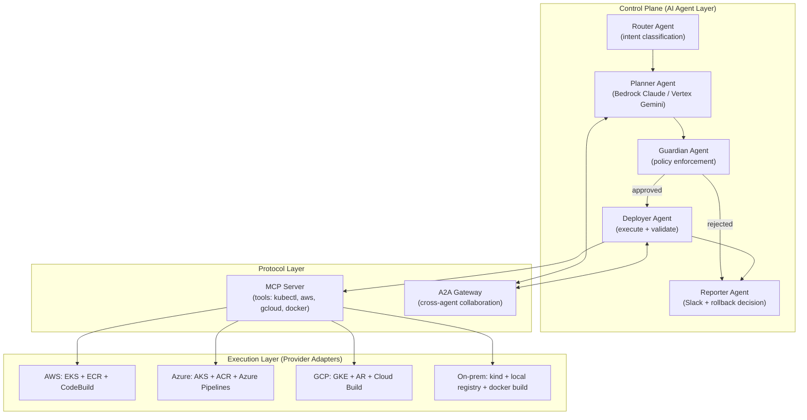
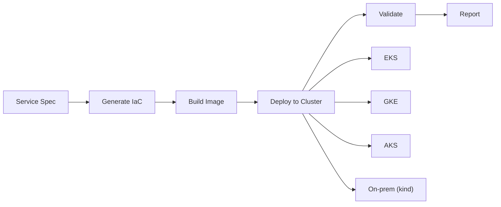

# 2026-07-05 — Multi-Cloud AI Agent Deployment Platform

> platform-agent를 AI 에이전트가 직접 인프라를 제어하는 멀티클라우드 배포 플랫폼으로 확장한다.
> CLI 호출이 아닌 **AI Agent가 판단하고 실행**하며, 가드레일은 **시스템 경계(IAM/RBAC/policy)** 기반.

---

## 1. Problem Statement

전통적인 배포 자동화는 스크립트의 나열이다:

```
코드 작성 → 이미지 빌드 → 이미지 저장 → 클러스터 배포 → API 검증 → Git 커밋
```

이 흐름은 반복 가능한 패턴이지만, **판단이 없다.**
- 배포 실패 시 누가 롤백을 결정하는가?
- canary 메트릭이 나빠지면 누가 분석하는가?
- 멀티클라우드 환경에서 같은 서비스를 GKE → EKS → on-prem 순서로 롤아웃할 때 누가 조율하는가?

**답: AI Agent가 한다.** 단, 에이전트가 얼마나 똑똑한지보다 **어디까지 할 수 있고 어디서 멈춰야 하는지**가 더 중요하다.

> **Agentic AI의 가드레일은 프롬프트가 아니라 시스템 경계를 기반으로 해야 한다.**

---

## 2. Goals

1. **AI Agent가 배포 파이프라인을 자율적으로 실행** (plan → guard → deploy → validate → report)
2. **동일 워크플로로 AWS(EKS), GCP(GKE), Azure(AKS), On-prem(kind)** 커버
3. **시스템 레벨 가드레일** — IAM/RBAC/namespace isolation/policy-as-code
4. **Strands(AWS) + ADK(GCP)** 공통 인터페이스, MCP + A2A 프로토콜 연결
5. **Mac 로컬에서 on-prem K8s 환경** 완전 구동 (kind + local registry)

---

## 3. Architecture

### 3.1 High-Level Flow

```
Service Spec (YAML)
    → Planner Agent (IaC 생성: CDK/Helm/kustomize)
    → Guardian Agent (정책 검증: RBAC, cost, blast radius)
    → Deployer Agent (빌드 → 푸시 → 배포 → 검증)
    → Reporter Agent (Slack 리포트, 롤백 판단)
```

### 3.2 System Diagram



### 3.3 Provider Abstraction



| 단계 | AWS | GCP | Azure | On-prem |
|------|-----|-----|-------|---------|
| 클라우드 제어 | `aws cli` / Strands tools | `gcloud` / ADK tools | `az cli` / Azure SDK | `kubectl` direct |
| 이미지 빌드 | CodeBuild | Cloud Build | Azure Pipelines / ACR Tasks | `docker build` (local) |
| 이미지 저장 | ECR | Artifact Registry | ACR | local registry (localhost:5001) |
| 클러스터 배포 | `kubectl` + Helm | `kubectl` + Helm | `kubectl` + Helm | `kubectl` + kustomize |
| 검증 | `curl` + CloudWatch | `curl` + Cloud Monitoring | `curl` + Azure Monitor | `curl` + `kubectl logs` |

---

## 4. Technology Choices

### 4.1 AI Agent Frameworks

| Framework | Provider | 근거 |
|-----------|----------|------|
| **Strands Agents SDK 1.0** | AWS | Model-driven, MCP 네이티브, Multi-agent (Swarm/Graph/Supervisor), Bedrock/Nova 직접 연동, K8s 배포 공식 가이드 |
| **Google ADK** | GCP | A2A 프로토콜 네이티브, Vertex AI Agent Engine 관리형 배포, Gemini 연동, 4.7M+ 다운로드 |

**공통 인터페이스:**
```python
class PlatformAgent(ABC):
    """Provider-neutral agent interface."""
    @abstractmethod
    def plan(self, spec: ServiceSpec) -> DeploymentPlan: ...
    @abstractmethod
    def deploy(self, plan: DeploymentPlan) -> DeployResult: ...
    @abstractmethod
    def validate(self, deployment: DeployResult) -> ValidationResult: ...
    @abstractmethod
    def rollback(self, deployment: DeployResult) -> RollbackResult: ...
```

### 4.2 Agent Communication

| 프로토콜 | 역할 | 사용 위치 |
|----------|------|-----------|
| **MCP (Model Context Protocol)** | 도구 제공 (kubectl, aws, docker 등) | Strands Agent ↔ 외부 시스템 |
| **A2A (Agent2Agent)** | 에이전트 간 task 위임/협업 | ADK Agent ↔ Strands Agent (cross-cloud) |

**Bridge 패턴:**
```
Strands Agent → MCP tool "a2a_call" → A2A Gateway (FastAPI) → ADK Agent
ADK Agent → A2A task request → A2A Gateway → MCP tool → Strands Agent
```

### 4.3 On-prem Environment (Mac)

| Component | Tool | 근거 |
|-----------|------|------|
| Container Runtime | Docker / Colima | Apple Silicon 네이티브 |
| K8s Cluster | **kind** | Docker 기반, 가장 경량, 멀티노드 지원, 공식 local registry 가이드 |
| Registry | kind 내장 (localhost:5001) | Harbor는 오버킬, 테스트 용도에는 기본 registry 충분 |
| Ingress | NGINX Ingress Controller | kind에서 공식 지원 |

**구성 목표:**
```bash
make local-cluster       # kind 3노드 + local registry + ingress
make local-cluster-down  # 정리
```

### 4.4 IaC Strategy (혼합)

| 대상 | 도구 | 용도 |
|------|------|------|
| AWS 인프라 (VPC/EKS/IAM) | **CDK (TypeScript)** | 기존 platform-agent 스택 유지 |
| K8s 워크로드 | **Helm + kustomize** | 멀티클라우드 동일 manifest |
| GCP 인프라 | **gcloud CLI / Terraform** | ADK agent가 직접 호출 |
| Azure 인프라 (AKS/ACR) | **az cli / Bicep** | Azure SDK 또는 agent 직접 호출 |
| On-prem | **kind config + kubectl** | 로컬 테스트, IaC 불필요 |

---

## 5. Guardian Agent — System-Level Guardrails

> 프롬프트가 아닌 **코드 + 인프라 레벨** 정책 강제

### 5.1 Policy Layers

```
Layer 1: IAM / RBAC (infra level)
  └── Agent ServiceAccount는 deploy/validate만 가능, delete/terminate 불가

Layer 2: Namespace Isolation (K8s level)
  └── prod namespace는 추가 승인 필요, staging/dev는 자율

Layer 3: Policy-as-Code (agent level)
  └── YAML 기반 정책 파일, Guardian Agent가 평가

Layer 4: Blast Radius Check (runtime)
  └── 변경 영향 범위가 threshold 초과 시 자동 APPROVE 모드 전환
```

### 5.2 Policy Schema

```yaml
# policies/deploy-policy.yaml
apiVersion: platform-agent/v1
kind: GuardianPolicy
metadata:
  name: deployment-safety
spec:
  rules:
    - action: "deploy"
      namespace: "prod"
      mode: APPROVE  # 항상 사람 승인 필요
    - action: "deploy"
      namespace: "staging|dev"
      mode: AUTO     # Agent 자율 실행
    - action: "delete|terminate|drop"
      mode: REJECT   # 무조건 차단
    - action: "rollback"
      mode: AUTO     # 롤백은 긴급이므로 자동 허용
  limits:
    max_replicas_change: 5       # 한번에 5개 이상 스케일 변경 → APPROVE
    max_cost_increase_pct: 20    # 비용 20% 이상 증가 → APPROVE
```

---

## 6. Strands Multi-Agent Pattern

Strands 1.0의 **Graph** 패턴을 사용한 배포 파이프라인:

```python
from strands import Agent
from strands.multiagent import GraphBuilder

# 각 전문 에이전트 정의
planner = Agent(model=bedrock_claude, system_prompt=PLANNER_PROMPT, tools=[spec_parser, manifest_gen])
guardian = Agent(model=bedrock_claude, system_prompt=GUARDIAN_PROMPT, tools=[policy_eval, rbac_check])
deployer = Agent(model=bedrock_claude, system_prompt=DEPLOYER_PROMPT, tools=[build, push, deploy, validate])
reporter = Agent(model=bedrock_claude, system_prompt=REPORTER_PROMPT, tools=[slack_notify, metrics_query])

# Graph 오케스트레이션 (DAG with feedback loop)
pipeline = (
    GraphBuilder()
    .add_node("plan", planner)
    .add_node("guard", guardian)
    .add_node("deploy", deployer)
    .add_node("report", reporter)
    .add_edge("plan", "guard")
    .add_edge("guard", "deploy", condition=lambda r: r["decision"] == "APPROVED")
    .add_edge("guard", "report", condition=lambda r: r["decision"] == "REJECTED")
    .add_edge("deploy", "report")
    .add_edge("report", "deploy", condition=lambda r: r.get("rollback"))  # feedback
    .build()
)

# 실행
result = pipeline.run(input={"spec": service_spec, "provider": "local"})
```

---

## 7. On-prem Setup (Mac)

### 7.1 Prerequisites

```bash
brew install kind kubectl helm docker colima
```

### 7.2 kind Cluster Config

```yaml
# infra/local/kind-config.yaml
kind: Cluster
apiVersion: kind.x-k8s.io/v1alpha4
nodes:
  - role: control-plane
    kubeadmConfigPatches:
      - |
        kind: InitConfiguration
        nodeRegistration:
          kubeletExtraArgs:
            node-labels: "ingress-ready=true"
    extraPortMappings:
      - containerPort: 80
        hostPort: 80
        protocol: TCP
      - containerPort: 443
        hostPort: 443
        protocol: TCP
  - role: worker
  - role: worker
containerdConfigPatches:
  - |-
    [plugins."io.containerd.grpc.v1.cri".registry.mirrors."localhost:5001"]
      endpoint = ["http://kind-registry:5001"]
```

### 7.3 Expected Workflow

```bash
# 1. 클러스터 생성
make local-cluster

# 2. 서비스 배포 (Agent 방식)
python -m src.agents.ai.strands_deployer \
  --spec examples/orders-api.yaml \
  --provider local

# 3. 검증
curl http://localhost:80/healthz

# 4. 정리
make local-cluster-down
```

---

## 8. Task Breakdown

### Task 1: On-prem 환경 구성 (kind + local registry) [auto]

**목표:** Mac에서 `make local-cluster` 한 번으로 kind 3노드 클러스터 + 로컬 레지스트리 동작.

**구현:**
- `infra/local/kind-config.yaml` — 1 control + 2 worker + registry mirror
- `infra/local/setup.sh` — kind create + registry container + NGINX ingress
- `infra/local/teardown.sh` — kind delete + registry 제거
- Makefile 타겟: `local-cluster`, `local-cluster-down`, `local-cluster-status`

**테스트:**
- `kubectl get nodes` → 3노드 Ready
- `docker build -t localhost:5001/hello:v1 . && docker push localhost:5001/hello:v1`
- `kubectl run hello --image=localhost:5001/hello:v1` → Running

**Demo:** `make local-cluster && kubectl get nodes` 성공.

---

### Task 2: Deployment Adapter 추상화 [auto]

**목표:** 배포 워크플로의 각 단계(Build/Push/Deploy/Validate/Rollback)를 ABC로 정의하고 provider 구현.

**구현:**
```
src/agents/adapters/deployment/
├── base.py          # ABC: BuildAdapter, RegistryAdapter, ClusterAdapter
├── registry.py      # get_deployment_adapters(provider) factory
├── local.py         # docker build + localhost:5001 + kubectl apply
├── aws.py           # CodeBuild + ECR + EKS kubectl
├── gcp.py           # Cloud Build + AR + GKE kubectl
└── azure.py         # Azure Pipelines + ACR + AKS kubectl
```

**테스트:**
- `LocalBuildAdapter.build(spec)` → docker build 성공 (mock)
- `LocalClusterAdapter.deploy(manifest)` → kubectl apply dry-run
- factory 함수 provider="local"|"aws"|"gcp"|"azure" 라우팅 검증

**Demo:** `get_deployment_adapters("local").deploy(manifest)` → kind에 리소스 생성.

---

### Task 3: Service Spec 스키마 + Manifest 생성 [auto]

**목표:** cloud-neutral ServiceSpec YAML → K8s Deployment/Service/Ingress manifest 변환.

**구현:**
- `src/agents/models.py`에 `ServiceSpec` dataclass 추가
- `src/agents/provisioning/manifest_generator.py` — spec → K8s YAML dict
- `examples/orders-api.yaml` — 예시 spec 파일

**테스트:**
- ServiceSpec → manifest → `kubectl apply --dry-run=client` 통과
- replicas, ports, resources, health check 반영 확인

**Demo:** `python -m src.agents.provisioning.manifest_generator examples/orders-api.yaml` → 유효한 YAML 출력.

---

### Task 4: Strands Deployer Agent (AWS/Local) [auto]

**목표:** Strands SDK로 배포 에이전트 구현. MCP tools를 통해 배포/검증을 자율 수행.

**구현:**
- `src/agents/ai/__init__.py`
- `src/agents/ai/strands_deployer.py` — Agent 정의 + system prompt
- `src/agents/ai/tools/build.py` — @tool: docker build
- `src/agents/ai/tools/push.py` — @tool: registry push
- `src/agents/ai/tools/deploy.py` — @tool: kubectl apply
- `src/agents/ai/tools/validate.py` — @tool: health check + readiness
- `src/agents/ai/tools/rollback.py` — @tool: kubectl rollout undo
- `pyproject.toml`에 `strands-agents>=1.0` 의존성 추가

**테스트:**
- mock model로 tool 호출 시퀀스 검증 (build→push→deploy→validate)
- rollback 시나리오: validate 실패 → rollback tool 호출 확인

**Demo:** Agent에 "Deploy orders-api v1 to local" → kind에 Pod 생성 + health 확인.

---

### Task 5: ADK Deployer Agent (GCP) + Azure Adapter [auto]

**목표:** Google ADK로 배포 에이전트 구현 + Azure deployment adapter. A2A Agent Card로 discover 가능.

**구현:**
- `src/agents/ai/adk_deployer.py` — ADK Agent 정의
- `src/agents/ai/a2a_card.json` — Agent Card (capabilities, endpoint)
- `src/agents/ai/tools/gcp_build.py` — Cloud Build 트리거
- `src/agents/ai/tools/gcp_deploy.py` — GKE kubectl apply
- `src/agents/ai/tools/azure_build.py` — ACR Tasks 빌드
- `src/agents/ai/tools/azure_deploy.py` — AKS kubectl apply
- `src/agents/adapters/deployment/azure.py` — Azure Pipelines + ACR + AKS

**테스트:**
- ADK test harness로 tool 호출 검증
- A2A card JSON schema validation

**Demo:** ADK agent가 kind(또는 GKE) 대상으로 배포 수행.

---

### Task 6: Guardian Agent (Policy-as-Code) [auto]

**목표:** 모든 배포 요청이 Guardian을 통과. YAML 정책 기반 차단/승인.

**구현:**
- `src/agents/ai/guardian.py` — Guardian Agent (Strands)
- `src/agents/ai/policies/deploy-policy.yaml` — 기본 정책
- `src/agents/ai/policy_engine.py` — 정책 파싱 + 평가 로직

**테스트:**
- prod namespace deploy → APPROVE 모드 강제
- staging deploy → AUTO 통과
- delete 액션 → REJECT
- replicas > 5 변경 → APPROVE

**Demo:** Agent가 prod 배포 시도 → Guardian이 차단 → Slack 승인 요청.

---

### Task 7: MCP + A2A Gateway [auto]

**목표:** Strands(MCP)와 ADK(A2A) 에이전트 간 cross-protocol 협업.

**구현:**
- `src/agents/ai/gateway/mcp_server.py` — kubectl/docker MCP 도구 서버
- `src/agents/ai/gateway/a2a_server.py` — FastAPI A2A endpoint
- `src/agents/ai/gateway/bridge.py` — MCP↔A2A 번역 레이어
- `src/agents/ai/tools/a2a_call.py` — Strands @tool로 A2A 에이전트 호출

**테스트:**
- Strands agent → a2a_call → ADK agent 응답 확인
- A2A task → MCP tool 실행 → 결과 반환

**Demo:** AWS agent가 GCP agent에 "canary 분석 해줘" → 결과 수신.

---

### Task 8: E2E Pipeline Orchestration (Graph) [auto]

**목표:** Strands Graph 패턴으로 plan→guard→deploy→validate→report 전체 흐름 연결.

**구현:**
- `src/agents/ai/pipeline.py` — GraphBuilder 기반 DAG
- `src/agents/ai/orchestrator.py` — CLI entry point
- feedback loop: validate 실패 시 rollback → report

**테스트:**
- happy path: spec → plan → guard(pass) → deploy(kind) → validate(success) → report
- rollback path: validate fail → rollback → report

**Demo:** `make deploy-local spec=examples/orders-api.yaml` → 전체 파이프라인 자동 실행.

---

### Task 9: Overnight Harness 연동 [auto]

**목표:** NEXT_PLAN.md 업데이트 + overnight 루프로 자동 구현.

**구현:**
- `docs/NEXT_PLAN.md`에 Task 1~8을 `[auto]` 마크로 등록
- gate: `make check` (pytest + 새 테스트 포함)
- `make overnight-kiro-once`로 smoke test

**Demo:** overnight 루프가 Task 1 자동 구현 + commit.

---

## 9. Non-Goals (Out of Scope)

- Multi-region replication — 단일 리전으로 충분
- 멀티 lane 병렬 overnight 루프 — 단일 lane으로 충분
- Production 배포 — 이번은 로컬/staging 레벨 검증까지

---

## 10. Success Criteria

- [ ] `make local-cluster` → kind 3노드 + registry 동작
- [ ] `make deploy-local spec=examples/orders-api.yaml` → Agent가 자율 배포 완료
- [ ] Guardian이 prod 배포 차단, staging 통과
- [ ] Strands ↔ ADK cross-agent 통신 성공 (MCP + A2A)
- [ ] Azure adapter (ACR + AKS) 단위 테스트 통과
- [ ] 전체 flow 5분 이내 (local cluster 기준)
- [ ] `make check` gate 통과 (기존 159 tests + 신규)

---

## 11. Azure Account Setup

| 옵션 | 비용 | AKS | 비고 |
|------|------|-----|------|
| **Free Account** | $200 크레딧 (30일) | ✅ AKS Free tier | 카드 등록 필요 |
| **Azure for Students** | $100 크레딧 (12개월) | ✅ | 학교 이메일 or GitHub Student Pack |
| **Pay-as-you-go** | 사용한 만큼 | ✅ AKS Free tier = 관리비 $0 | 워커 노드 VM만 과금 |

**AKS Free tier:** 관리 평면 비용 $0. 워커 노드 `Standard_B2s` (2vCPU, 4GB) 1대 ≈ $30/월.

```bash
# Azure CLI 설치
brew install azure-cli

# 로그인
az login

# AKS 클러스터 생성 (Free tier)
az aks create --resource-group platform-agent-rg --name platform-agent-aks \\
  --node-count 1 --node-vm-size Standard_B2s --tier free
```

---

## 12. References

- [Strands Agents SDK](https://strandsagents.com/) — AWS, MCP 네이티브
- [Google ADK](https://cloud.google.com/products/agent-builder) — GCP, A2A 네이티브
- [A2A Protocol](https://github.com/google/A2A) — 에이전트 간 협업 표준
- [kind](https://kind.sigs.k8s.io/) — K8s in Docker
- [agent-toolkit-for-aws](https://github.com/aws/agent-toolkit-for-aws) — AWS MCP Server
- [Harbor + Kind + Colima](https://medium.com/@andy.f.mcbrearty/how-to-run-a-local-harbor-registry-on-a-mac-with-colima-and-kind-e27116aa0c9c)
- [Strands Multi-Agent Patterns](https://strandsagents.com/blog/strands-agents-1-0/)
- [ADK + A2A Integration](https://cloud.google.com/blog/products/ai-machine-learning/unlock-ai-agent-collaboration-convert-adk-agents-for-a2a)
